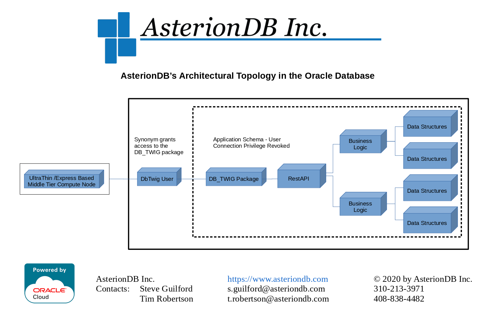

# DbTwig - An Ultra-Thin Middle-Tier Framework

**Comprised of a few hundred lines of JS/Express code and a PL/SQL package that's about 75 lines in length, DbTwig has to be the smallest, lightest fully functional middle-tier framework that will ever be.  In fact, this README.md is bigger than DbTwig itself.**

We know.  It seems crazy. But, when you build applications following patterns innovated by AsterionDB, that's all you need.  By utilizing DbTwig, you will embrace a software architecture that forces you to write secure applications and combats cybersecurity threats in ways that you have never imagined.

AsterionDB allows the Oracle database to seamlessly manage unstructured (e.g. file based) data. We migrate all of your digital assets out of the legacy file system and into the database. *(For those of you that think it's scary to store files in a database, remember, the legacy file system is a database too.)* Given that they're now in the database, we don't need to keep a static filename anymore.

Think about it, if all of your files are now stored in the database and there are no more PDFs in your directories, how does ransomware infect your files?  They're not there anymore!

**With DbTwig, everyone can build applications that are inherently secure and resistant to cybersecurity attack. If this is intriguing to you, please continue reading!**

## Why do I want to use DbTwig?

    1.  You will be using a framework and an architecture that forces you to write secure applications
    2.  You will have an architectural basis from which to fight cybersecurity threats
    3.  You will be building an architecture that is resilient to cybersecurity attacks
    4.  You will be reducing the threshold between intrusion and detection
    5.  You will be bringing the logic as close to the data as technically possible
    6.  You will increase code reusability
    7.  You will backup your data and logic together in one operation
    8.  You will restore your data and logic together in one operation
    9.  You will secure your logic using the same policies that are in place for data security
    10. You will simplify audit and compliance activities
    11. You will streamline development by focusing on data-layer and presentation-layer technologies
    12. You will be writing less code and getting more done
    13. You will be reducing the number of components and technologies required to achieve your goals
    14. You will simplify troubleshooting and hot patching
    15. You will be using a framework and an architecture that forces you to write secure applications

## DbTwig - The Basic Concept

So, its really pretty simple.  AsterionDB has pioneered the ability to merge all data types within the Oracle database.  That means structured and unstructured data is managed equally, side-by-side, within the database.  A photograph that you previously had to store outside of the RDBMS is now just another data type that you manage and secure like anything else.  This has profound security implications.

Naturally of course, if you have all of your data in the database, you're going to want all of your business logic there too.  As you might suspect, this also has very significant and profound implications. 

The recent integration of JSON capabilities in the Oracle database now makes it possible to incorporate all business logic at the data-layer. For years,programmers have been able to use stored logic in the database to access and modify information.  However, it was difficult to return a 'set' of information (e.g. a set of rows return from a SELECT statement).  This has forced us, for the most part, to implement our SELECT statements directly in middle-tier code.  This architectural requirement forces us to provide **'schema visibility'** in the middle-tier in order to execute SELECT statements.  

By using JSON in a strategic manner, we are able to move our SELECT statements down within an API in the database. This allows us to turn off schema visibility in the middle-tier.  Now, all requests for data are in the form of an API call that is satisfied entirely within the secure confines of the database. The middle-tier does not need to know the 'layout' of the data in order to find what it needs.  It just needs to know the appropriate API call to make. 

**Removing schema visibility is essential to being able to build a hyper-secure architecture.**

This is exactly the approach that AsterionDB takes and the innovation that we bring to market.  DbTwig is a core technology that we use to make this all happen. DbTwig is technology you can use to gain the same level of efficiency and security that AsterionDB embodies.

By migrating all of your business logic down to the data layer you can implement an architecture that requires all API requests to proceed through audited, protected code.  Your business logic brokers all access to underlying data. There's no way to get at the data without going through the code. In a production environment, this is gold when it comes to security. It also has a huge, positive impact on audit and compliance.

The Oracle database allows us to build a logical architecture that looks somewhat like a funnel - data at the top, logic below leading down to a single access point - DbTwig. By leveraging JSON to convey our parameters and result data, we can create a choke point at the tip of the funnel.  This choke point is embodied by a sole function that delegates all valid API requests to logic further up the funnel.  That single choke point is DbTwig.

The DbTwig package looks at the JSON parameters and determines the appropriate logic to delegate to.  This is the technique that allows us to condense API access down to one function in a specific package.

Are you still with us? Good!

    * You've got all of your data in the database
    * You've got all of your business logic in the database too
    * You've got a single access point that all API requests are going to go through

We have a dedicated DbTwig user in the database that the middle-tier will use to connect to the database.  This dedicated user will have no privileges other than the ability to connect to the database.  It will not own any objects other than a synonym - **that's it!**  The synonym will point to the DbTwig package within the DbTwig schema; that's the extent of the DbTwig middle-tier user's universe.  A package with one function to call a generic API and another function to log errors. That's all it can see! That's all it needs to see!

During production use, the only two accounts that can connect to the database are the DBA and the DbTwig middle-tier user. Remember, the DbTwig user can't see anything.  All it gets to do is pass messages on from the middle-tier and return data from the database.  **This is how we create a hyper-secure environment!!!  Now you can too.**  

For an unfortunate hacker, it's like being in a dark room with no light switches.  But, there's motion sensors and microphone listening to everything you say.  You better not bump into anything or say something wrong because that would be an **error**.  Errors are not allowed and it either indicates a bug in the client or a possible intruder trying to use a brute-force approach to breaking in.

## Prerequisite Knowledge

If you are an Oracle programmer, familiar with PL/SQL, you're going to be able to pick up this technology within minutes.  It is made for the way Oracle programmers work and think.

You'll also need to be familiar with JSON. Chances are, you probably already know enough about JSON to get started. One skill you will need to acquire is knowing how to utilize the integrated JSON capabilities in the Oracle DB. Oracle's JSON capabilities are very powerful. AsterionDB specifically leverages JSON to create a procedural interface for all data acquisition requests. In simple terms, we have PL/SQL functions that return JSON data - the data your API selected from the database.

If you don't know how to use JSON within PL/SQL do not worry - our example program will give you an introduction to using JSON in the database.

## Presentation/Client Layer

So...you've got PL/SQL at the data-layer and a micro-thin NodeJS based middle-tier. For the presentation layer, you get to use whatever you want!  All you have to do is send and receive JSON data to a RESTAPI (i.e. DbTwig).

## The AsterionDB Design Philosophy

The essence of the AsterionDB design philosophy is:

    1. All data is to be stored in the database
    2. All business logic is to be stored in the database
    3. All schema owner's have connection privilege revoked
    4. All access is by a dedicated, minimally provisioned and privileged middle-tier user

Here's an architectural topology diagram:



As mentioned previously, the recent incorporation of JSON capabilities in Oracle is key to making it possible to put all business logic in the database. As powerful as the Oracle database is, there are still instances where you will need to extend the logical capability of the database.  AsterionDB has a lot of experience in this regard.  Some examples of extended logical capabilities are:

    1. Extracting meta-data from multimedia files
    2. Transcoding media files
    3. Sending emails from the database
    4. Processing an image w/ OCR technology to extract text data
    5. Controlling telecommunications devices
    6. Sending SMS messages
    7. Interacting with Google's OAuth server

## DbTwig System Requirements

DbTwig's system requirements are very simple:

    * Oracle version 18 and above
    * OracleLinux versions 7 & 8 (other RedHat derivatives will work as well but OL is what we support)
    * Nginx
    * NodeJS v10.x

## DbTwig Components

DbTwig is comprised by the following components:

    1. A JavaScript based middle-tier listener 
    2. The DbTwig Services table in the database - owned by the DbTwig schema
    3. The DbTwig package in the database - owned by the DbTwig schema
    4. A middle-tier mapping table owned by your application
    5. A dedicated user in the database for the middle-tier listener
    6. A synonym to map the middle-tier user to the DbTwig package

### The DbTwig Middle-Tier Listener

The DbTwig middle-tier listener is a JavaScript NodeJS/Express based application.  It's job is to listen for HTTP requests and transform them into a database call to the DbTwig package. The DbTwig listener is implemented as a system service and managed using standard 'systemctl' commands. The DbTwig listener logs messages into the system message log file using 'syslog'.

### The DbTwig Services Table

The DbTwig Services table allows us to map an external DbTwig service name to the schema owner that implements the service.  The URL's used to access a DbTwig service and make RESTAPI calls are derived from the following example:

    https://your.server.com/dbTwig/yourServiceName/entryPointName

The DbTwig Services table maps 'yourServiceName' to your schema name.

### The DbTwig Package

The DbTwig package receives incoming RESTAPI requests, consults the DbTwig Services table and the target service's middle_tier_map and then makes the appropriate function or procedure call.

### The DbTwig Middle-Tier Map Table

All DbTwig services (i.e. your application) contain a table - middle_tier_map - that maps the 'entryPointName' of an incoming RESTAPI request to the corresponding function or procedure to call within your application.  The middle_tier_map table is created by the script ./dbTwig/dba/middleTierMap.sql.

### The DbTwig Middle-Tier User

DbTwig utilizes a dedicated, minimally provisioned and privileged database user for middle-tier connection purposes. This user owns a synonym that points to the DbTwig package in the DbTwig schema. The DbTwig middle-tier user is granted execute privilege upon the DbTwig package.

### The DbTwig Synonym

The DbTwig middle-tier user owns a synonym that maps to the DbTwig package.

## Installing DbTwig

DbTwig is a core technology component within the AsterionDB product.  Installing AsterionDB will also install DbTwig.  With AsterionDB installed and functional you will be ready to begin developing or integrating your application into DbTwig & AsterionDB.

## Integrating your Application into DbTwig

As outlined above, DbTwig relies upon a mapping table within your application's schema to associate entryPointName's with the function or procedure to be called.  Execute the following script to create the middle_tier_map table:

    /home/asterion/asterion/oracle/dbTwig/dba/middleTierMap.sql

Typically, this script would be executed once when you are creating or first integrating your application with DbTwig.  If you are building a redistributable application that will install upon a target database, you may choose to call the middelTierMap.sql script from your application's installer.

With the middle_tier_map table created you will grant select privileges to the DbTwig user:

    grant select on middle_tier_map to dbtwig;

The middle_tier_map table maps your external URL to the appropriate function or procedure to be called.  This allows us to hide our internal service and entry point names from the outside world.

It is a best practice to put your functions and procedures within a package.  This package can then act as a delegater to other packages within your application.  It is also the only package that you need to expose to DbTwig.  Most applications can expose just one package while larger applications may find it best to expose a two or three.  In either case, you will grant execute access to your package(s) to the DbTwig user:

    grant execute on my_api_package to dbtwig;

Finally, you will tell DbTwig about your DbTwig Service by inserting a row into the db_twig_services table.  For security purposes, this left as a manual operation for your DBA to perform.  Connect to the database as a DBA and issue the following insert statement:

    insert into dbtwig.db_twig_services('yourServiceName', 'yourSchemaName');

## Designing Your RestAPI Package ##

To review, the DbTwig paradigm calls for all functions and procedures to accept a JSON parameter string.  The JSON parameter string can be empty if the function or procedure does not require any parameters.  Functions will return information as a JSON string. Maintaining this function and procedure signature allows us to implement a simple, straightforward middle-tier.  

  **Caveat:  The JSON parameter string is for input values to DbTwig.  It can not be used to return values from a procedure. All returned values must be sent in a JSON string from a function.**

It is also a best practice to limit the number of packages exposed to DbTwig.  The package(s) exposed to DbTwig will be responsible for unpacking the JSON parameters, validating them against database-types variables and then delegating the call to the appropriate logic. Here's a simple example of a package header:

```
create or replace package example_package as

  procedure create_insurance_claim
  (
    p_json_parameters                 clob
  );

  function get_insurance_claim_detail
  (
    p_json_parameters                 clob
  )
  return clob;

end example_pakcage;
```

Here's an example of a corresponding package body:

```
create or replace package body example_program as

  procedure create_insurance_claim
  (
    p_json_parameters                 clob
  )
  
  is

    l_json_object                     json_object_t := json_object_t(p_json_parameters);
    l_insured_party_id                insurance_claims.insured_party_id%type := 
      l_json_object_t.get_string('insuredPartyId');

  begin

    insert into insurance_claims
      (insured_party_id,...)    
    values
      (l_insured_party_id,...);

  end create_insurance_claim;

  function get_insurance_claim_detail
  (
    p_json_parameters                 clob
  )
  return clob

  as

    l_json_object                     json_object_t := json_object_t(p_json_parameters);
    l_claim_id                        insurance_claims.claim_id%type :=
      l_json_object.get_number('claimId');
    l_clob                            clob;

  begin

    select  json_object(
              'insuredParty' is insured_party,
              'accidentDate' is to_char(accident_date, 'dd-MON-yyyy'),
              'accidentLocation' is accident_location,
              'deductibleAmount' is deductible_amount,
              'claimsAdjusterReport' is claims_adjuster_report,
              'claimPhotos' is get_insurance_claim_photos(l_claim_id) format json
              returning clob)
      into  l_clob
      from  insurance_claims
     where  claim_id = l_claim_id;

    return l_clob;

  end get_insurance_claim_detail;

end example_pakcage;  
```
It is important to note how we are extracting the JSON parameters into database typed variables when they are declared. Good programmers always verify incoming parameter types and value lengths as soon as possible.

## Mapping A RestAPI Entry Point ##

For each function and procedure that you expose via DbTwig you will have to create a mapping entry in the middle_tier_map table.  The middle_tier_map maps out the external entry point name in your URL with the corresponding function or procedure. To create the mapping entry, simply insert (or update) the appropriate row in the middle_tier_map table.  Here's an example:

```
insert into middle_tier_map
  (entry_point, object_type, object_name)
values
  ('getInsuranceClaimDetail', 'function', 'example_package.get_insurance_claim_detail');

insert into middle_tier_map
  (entry_point, object_type, object_name)
values
  ('createInsuranceClaim', 'procedure', 'example_package.create_insurance_claim');
```
Developers will probably maintain the middle_tier_map table directly in SQL*Developer.

## Calling Your API via DbTwig ##

As mentioned prevously, the URL's used to access a DbTwig service and make RESTAPI calls are derived from the following example:

    https://your.server.com/dbTwig/yourServiceName/entryPointName

When building up a call to DbTwig, you will need to set the 'Content-Type' header to 'application/json'.  

If the function or procedure that you are calling requires parameters you will include those in the JSON body attached to the HTTP request.

DbTwig comes with integrated example applications. Please review the Readme.md's and the code for a practical demonstration of how a DbTwig RestAPI request can be made via HTTP.

# Project Summary

The goal of the DbTwig project is to provide an example of the thin execution layer utilized by the AsterionDB product set. AsterionDB's product design includes both structured and unstructured data in an Oracle database as well as the business Logic controlling access to that data 

The initial releases of the AsterionDB Product followed a typical model of parsing RESTAPI requests to perform function or procedure calls to stored logic in the database as well as issuing SELECT statements to obtain data. With Oralcle v18, the database was able to consume and emit JSON data.  This presented an opportunity to simplify the middle tier logic by packaging all parameters in a JSON string and similarly having the API return data in JSON format.

During some refactoring that took place in May & June of 2020, it was discovered that placing routing logic in a database function precluded the need to express that logic in the middle tier.  This reduced hundreds of lines of useless boilerplate code, but more importantly, it became clear that only one function, a chokepoint, needed to be exposed to the middle tier.

Thus, it was possible to have a dedicated database user that ONLY had the ability to Execute that choke point function.  The dedicated user does not own the tables or actual functions themselves.

This open source project was carved out of the initial components leveraged by AsterionDB in order to provide an example of the principles involved with DbTwig.  As this project progresses, the intention is to create a generic framework/gateway to database resident business logic.

## AsterionDB's Security Model

In AsterionDB, session tracking and user authentication is performed within the business logic in the database. The actual database schema (User) that owns the tables and logic can be provisioned during normal production use so that it can not connect to the database (i.e. create session privilege revoked).  Because all session tracking is in the database, this allows each API call to be a self-validating transaction that carries all information necessary to guarantee session validity. 

The DbTwig database user is just delegating the RESTAPI request.  As a result, the password of the DbTwig database user is of no great consequence. There would be nothing that the DbTwig database user can do that is not already exposed by the RESTAPI.

Far too often the DbTwig database user's password needs to be around somewhere in clear text (or the crypto-key to unscramble it) providing a false sense of security from intrusions at the middle tier.  Reliance on the middle tier providing application level access or having direct access to the database objects, means that system itself needs to have a higher critical patch consideration than if all of that logic is secured within the database.  Changes to stored logic within the database are much more easily audited, especially when the schema itself is locked except for maintenance, than the traditional middle tier application layer.  To compound the problem, the middle tier nodes may be getting their execution code from a shared file appliance that requires its own critical patch considerations.
