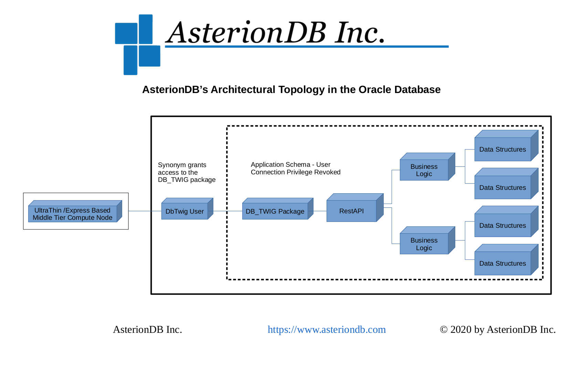

# DbTwig - An Ultra-Thin Middle-Tier Framework

**Comprised of a few hundred lines of JS/Express code and a PL/SQL package that's about 75 lines in length, DbTwig has to be the smallest, lightest fully functional middle-tier framework that will ever be.  In fact, this README.md is bigger than DbTwig itself.**

We know.  It seems crazy. But, when you build applications following patterns innovated by AsterionDB, that's all you need.  By utilizing DbTwig, you will embrace a software architecture that forces you to write secure applications and combats cybersecurity threats in ways that we have never imagined.

AsterionDB allows the Oracle database to seamlessly manage unstructured (e.g. file based) data. We migrate all of your digital assets out of the legacy file system and into the database. *(For those of you that think it's scary to store files in a database, remember, the legacy file system is a database too.)* Given that they're now in the database, we don't need to keep a static filename anymore.

Think about it, if all of your files are now stored in the database and there are no more PDFs in your directories, how does ransomware infect your files?  They're not there anymore!

**DbTwig is our gift to the open-source community and society in general so that everyone can build applications that are inherently secure and resistant to cybersecurity attack. If this is intriguing to you, please continue reading.**

## Why do I want to use DbTwig?

    1.  You will be using a framework and an architecture that forces you to write secure applications
    2.  You will have an architectural basis from which to fight cybersecurity threats
    3.  You will be building an architecture that is resilient to cybersecurity attacks
    4.  You will be reducing the threshold between intrusion and detection
    5.  You will be bringing the logic as close to the data as technically possible
    6.  You will backup your data and logic together in one operation
    7.  You will restore your data and logic together in one operation
    8.  You will secure your logic using the same policies that are in place for data security
    9.  You will simplify audit and compliance activities
    10. You will streamline development by focusing on data-layer and presentation-layer technologies
    11. You will be writing less code and getting more done
    12. You will be reducing the number of components and technologies required to achieve your goals
    13. You will simplify troubleshooting and hot patching
    14. You will increase code reusability
    15. You will be using a framework and an architecture that forces you to write secure applications

## DbTwig - The Basic Concept

So, its really pretty simple.  AsterionDB has pioneered the ability to merge all data types within the Oracle database.  That means structured and unstructured data is managed equally, side-by-side, within the database.  A photograph that you previously had to store outside of the RDBMS is now just another data type that you manage and secure like anything else.  This has profound security implications.

Naturally of course, if you have all of your data in the database, you're going to want all of your business logic there too.  As you might suspect, this also has very significant and profound implications. The recent integration of JSON capabilities in the Oracle database make it feasible to encorporate all business logic at the data-layer. Specifically, by moving all of your select statements into a package in the database, you can turn off schema visibility in the middle-tier. All requests for data are in the form of an API call that is satisfied entirely within the secure confines of the database. The middle-tier does not need to know the 'layout' of the data in order to find what it needs.  It just needs to know the appropriate API call to make. 

**Removing schema visibility is essential to being able to build a hyper-secure architecture.**

This is exactly the approach that AsterionDB takes and the innovation that we bring to market.  DbTwig is a core technology that helps to make this all happen. DbTwig is technology you can use to gain the same level of efficiency and security that AsterionDB embodies.

By migrating all of your business logic down to the data layer you can implement an architecture that requires all API requests to proceed through audited, protected code.  Your business logic brokers all access to underlying data. There's no way to get at the data without going through the code. In a production environment, this is gold when it comes to security. It also has a huge (i.e. positive) impact on audit and compliance.

The Oracle database allows you to build a logical architecture that looks somewhat like a funnel - data at the top, logic below leading down to a singular access point - DbTwig. By leveraging JSON to convey our parameters and result data, we can create a choke point at the tip of the funnel.  This choke point is embodied by a sole function that delegates all valid API requests to logic further up the funnel.  That single choke point is DbTwig.

The DbTwig function looks at the JSON parameters and determines the appropriate logic to delegate to.  This is the technique that allows you to condense API access down to one function in a specific package.

Are you still with us? Good.

    * You've got all of your data in the database
    * You've got all of your business logic in the database too
    * You've got a single access point that all API requests are going to go through

Now, you're going to revoke 'create session privilege' from your production application user and create a dedicated DbTwig user.  The DbTwig user will have no privileges other than the ability to connect to the database and it will own a synonym - **that's it!**  The synonym will point to the DbTwig package within your application schema; that's the extent of the DbTwig user's universe.  A package with one function to call a generic API and another function to log errors. That's all it can see. That's all it needs to see.

During production use, the only two accounts that can connect to the database are the DBA and the DbTwig user. Remember, the DbTwig user can't see anything.  All it gets to do is pass messages on from the middle-tier and return data from the database.  **This is how we create a hyper-secure environment!!!  Now you can too.**

## Pre-Requisite Knowledge

If you are an Oracle programmer, familiar with PL/SQL, you're going to be able to pick up this technology within minutes.  It is made for the way Oracle programmers work and think.

You'll also need to be familiar with JSON. Chances are, you probably already know enough about JSON to get started. One skill you will need to acquire though is knowing how to utilize the integrated JSON capabilities in the Oracle DB. Oracle's JSON capabilities are very powerful. AsterionDB specifically leverages JSON to create a procedural interface for all data acquisition requests. In simple terms, we have PL/SQL functions that return JSON data - the data your API selected from the database.

So...you've got PL/SQL at the data-layer. For the presentation layer, you get to use whatever you want!  All you have to do is send and receive JSON data to a RESTAPI (i.e. DbTwig).

## The AsterionDB Design Philosophy

This is the essence of the AsterionDB design philosophy:

    1. All data is to be stored in the database
    2. All business logic is to be stored in the database
    3. All schema owner's have connection privilege revoked
    4. All access is by a dedicated, minimally provisioned and privileged middle-tier user

Here's an architectural topology diagram:

As mentioned previously, the recent incorporation of JSON capabilities in Oracle is key to making it possible to put all business logic in the database. As powerful as the Oracle database is however, there are still instances where you will need to extend the logical capability of the database.  AsterionDB has a lot of experience in this regard.  Some examples of extended logical capabilities are:

    1. Extracting meta-data from multimedia files
    2. Transcoding media files
    3. Sending emails from the database
    4. Processing an image w/ OCR technology to extract text data
    5. Controlling telecommunications devices
    6. Sending SMS messages
    7. Interacting with Google's OAuth server

DbTwig and AsterionDB's design philosophy are direct results of the development and discovery we encountered in solving the unstructured data riddle.

## DbTwig System Requirements

DbTwig's system requirements are very simple:

    * Oracle version 18 and above
    * OracleLinux versions 7 & 8 (other RedHat derrivatives will work as well but OL is what we supports)
    * Nginx
    * NodeJS v10.x

## DbTwig Components

DbTwig is comprised of five components:

    1. A middle-tier listener
    2. A table in the database
    3. A package in the database
    4. A dedicated middle-tier user
    5. A synonym to map the middle-tier user to the DbTwig package

### The DbTwig Middle-Tier Listener

The DbTwig middle-tier listener is a JavaScript NodeJS/Express based application.  It's job is to listen for HTTP requests and transform them into a database call to the DbTwig package. The DbTwig listener is implemented as a system service and managed using standard 'systemctl' commands. The DbTwig listener logs messages into the system message log file using 'syslog'.

### The DbTwig Middle-Tier Map Table

DbTwig relies upon a table in the database - middle_tier_map - to map incoming RESTAPI requests to the corresponding function or procedure to call.

### The DbTwig Package

The DbTwig package receives incoming RESTAPI requests at the data-layer, consults the middle_tier_map and calls the appropriate function or procedure.

### The DbTwig Middle-Tier User

DbTwig utilizes a dedicated, minimally provisioned and privileged database user for middle-tier connection purposes. This user owns a synonym that points to the DbTwig package in the application's schema. The DbTwig middle-tier user is granted execute privilege upon the DbTwig package.

### The DbTwig Synonym

The DbTwig middle-tier user owns a synonym that maps to the DbTwig package.

## Installing DbTwig

### DbTwig Database Components

In the ./dbTwig/dba directory there is a file called installDbTwig.sql.  This file creates the middle-tier mapping table and loads the DbTwig package header & body into the database.  Depending upon your requirements, you may want to integrate this script into a master script that you use to install your application. Alternatively, you may run this once and be done with it. Run this script as **the owner of your application schema**.

To setup the DbTwig user, connect to the database as a DBA.  Issue the following commands, edited appropriately for your requirements.  You can choose whatever username you want (i.e. something other than dbtwig) for the DbTwig user.

    1. grant create session to dbtwig identified by "choose-a-password";
    2. create synonym dbtwig.db_twig for your_schema_owner.db_twig;
    3. grant execute on your_schema_owner.db_twig to dbtwig;

### DbTwig Middle-Tier Listener

The middle-tier listener is contained in the ./dbTwig/middleTier subdirectory.  Go to that directory and from a command prompt type:

    npm install

to install all of the middle-tier dependencies.

The listener has been integrated with systemd.  In the ./dbTwig/admin you will find two configuration files:

    1. asterion - Edit this file as required and copy it to /etc/sysconfig
    2. dbTwig.service - Edit this file as required and copy it to /usr/lib/systemd/system

To start and enable the DbTwig listener type the following commands:

    1. systemctl start dbTwig.service
    2. systemctl enable dbTwig.service

Check the system log file in /var/log/messages to verify proper operation of the DbTwig listener. You can also type:

    * systemctl status dbTwig.service

# Project Summary

The dbTwig Project has the goal of providing an example of the very thin execution layer utilized by the AsterionDB product set.
The AsterionDB Product design includes both the Data and the Business Logic controlling access to that data to reside within the Database.
The initial releases of the AsterionDB Product followed a typical model of parsing RESTful API requests, performing Function or Procedure calls to Stored Logic in the Database.  As the Database became able to work directly with JSON and to emit JSON, there was an opportunity to simplify the Middletier logic to generically package the parameters in JSON and to just return the resulting JSON emitted from the Database Functions as the response value.
During the latest Refactoring, it was discovered that the need to have the routing logic itself in the Middletier was no longer needed by placing the "routing" logic itself into a function within the Database.  This reduced hundreds of useless boilerplate code in the Middletier, but more importantly, it became clear that one the one function need be exposed.
Thus, it was possible to have a new Database User that ONLY had the ability to Execute that chokepoint function and no ownership of the Tables or actual functions themselves.

This Open Source Project has been started by carving out the initial pieces leveraged by AsterionDB in order to provide an example of the principles involved with DbTwig.  As this project progresses, the intention is to make it generic enough to *just use*, including a pattern within the Database portions to provide an extensible framework.

## Adoption of Successful Security Patterns
In AsterionDB, the session tracking and user authentication is performed within the Business Logic in the Database.  The actual Database Schema (User) within the Database that owns the Tables and Logic can be disabled for access when the system is not in active maintenance.  The dbTwig Database User is just delegating the RESTFul API request and so, the password of the dbTwig DB User is of no great consequence.  There would be nothing that the dbTwig DB User can do what is not already available from the exposed RESTful API.  Far too often the DB User Password needs to be around somewhere in clear text (or the Key to unscramble it is somewhere in clear text) providing a false sense of security from intrusions at the Middletier.
Reliance on the Middletier to provide Application Level access or having direct accesss to the Database Objects, means that system itself needs to have a higher critical patch consideration than if all of that logic is secured within the Database.
Changes to Stored Procedures within the Database, especially when the Schema itself is locked except when maintenance activities are underway, are much more easily audited than the filesystem of a Middletier which itself may be getting its execution code from a file share appliance - then the file share appliance or host is ALSO in need of higher critical patch considerations.
