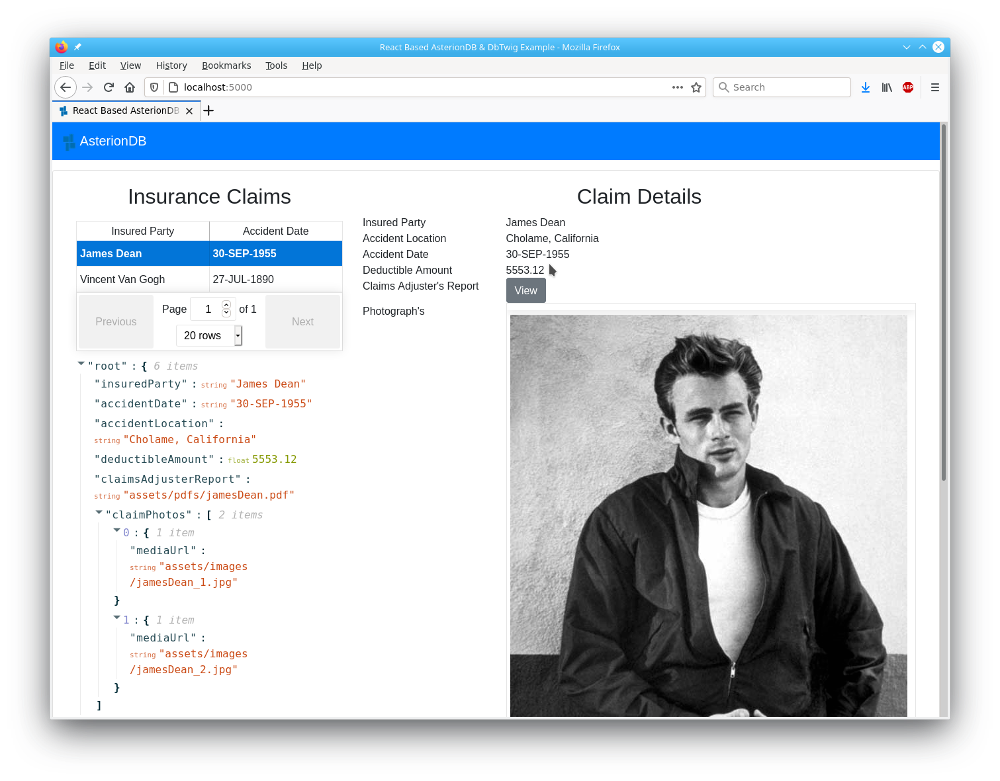
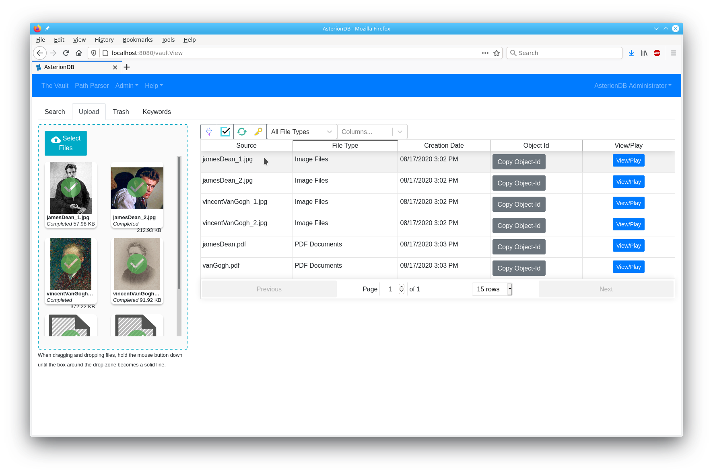
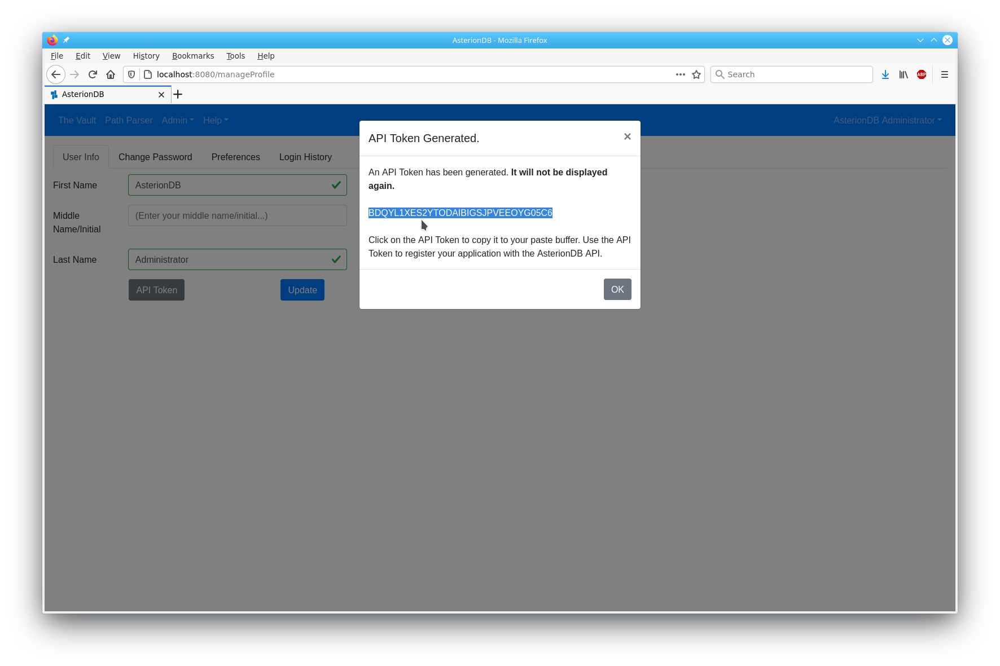
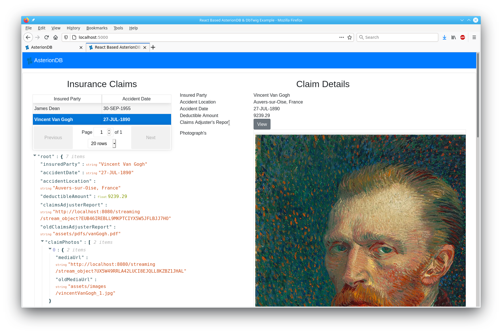

# React Based DbTwig / AsterionDB Example WebApp #

## Introduction ##

This React based example application will show you how to interface to DbTwig and AsterionDB.  It will also show you how to migrate an application from file-based to database oriented access.  The process really is quite simple and if you are already famlliar with PL/SQL, you'll be able to follow along without any problems at all!

This example focuses on the tasks involved in migrating an existing application.  Having a working knowledge of Oracle and PL/SQL is a requirement.  This example is not suitable for those that are just starting out with the aforementioned technologies.

Specifically, in order to follow along with this example you will have to meet these prerequisites:

  1.  Have a working installation of AsterionDB with an account that you can use to upload objects.
  2.  Know how to connect to your AsterionDB database with SQL*Developer (or a similar tool).
  3.  Working knowledge and familiarity with PL/SQL.
  4.  Familiarity with the JSON standard (note: it's so simple, you can probably look at it and figure it out...).
  5.  Working knowledge and familiarity with JavaScript, NodeJS and React.
  6.  Familiarity with DbTwig. We recommend that you consult the Readme.md for DbTwig.

## Objective ##

The object of this example application is to give you a realistic introduction to DbTwig & AsterionDB.  In the process you will learn the following:

  1.  Create an AsterionDB Client Application API Access Key
  2.  Upload objects into AsterionDB
  3.  Access the Object-IDs for the objects you have uploaded to AsterionDB
  4.  Modify an existing application to store Object-IDs instead of file pointers
  5.  Use JSON to return a complex master-detail 'document'
  6.  Generate a weblink by modifying a package in the database to interact with AsterionDB and DbTwig
  7.  Decouple changes in the data-model from the client application

After installation, we will start out by accessing the React example application in it's unmodified state.  We will upload objects to AsterionDB, modify the example application and see, with just a few changes, how easy it is to migrate an application.

## Connect To Your Compute Instance ##

You will need to connect to your compute instance from your local computer using an SSH tunnel.  Use the following SSH command:
```
  ssh asterion@your.ip.address -L 8080:localhost:8080 -L 5000:localhost:5000
```
This will open up tunnels for ports 8080 and 5000.

## Installation ##

The installation process performs the following steps:

  1.  Install system prerequisites
  2.  Run SQL*Plus to install the example application's schema objects
  3.  Build the JavaScript React example application
  
In order to install the React example application you will need to gather the following usernames and passwords:

  1.  DBA username and password
  2.  Choose a password for the DbTwig example schema

You can accept the default values for:

  1.  DbTwig schema username [dbtwig]
  2.  React example schema username [react_example] 
  3.  AsterionDB schema username [asteriondb_objvault]

From the **./asterion/oracle/dbTwig/examples/react** subdirectory run the installation script **install.sh** to install the react example application.
```
  cd /home/asterion/asterion/oracle/dbTwig/examples/react
  ./install.sh
```  
## Accessing The React Example Application ##

The React example application is designed to run in a stand-alone manner using it's own dedicated HTTP port address and server.  This allows us to isolate the application and keep it from impacting any other production or development systems.

While connected to your compute node as the 'asterion' user, type in the following commands:
```
    cd /home/asterion/asterion/oracle/dbTwig/examples/react/javaScript/reactExample
    serve -l 5000 -s build
```
This will run the Node-JS serve program and make the React example application available on port 5000.  To access the React example application, point your browser to:

    http://localhost:5000
    
or

    http://your.ip.address:5000

or

    http://your.server.name:5000

If you get a 404 error, it is most likely because you did not change to the ./examples/react/javaScript/reactExample subdirectory before you ran the serve program.

## The React Example Application - Serving Insecure File Based Assets ##

The React example application is a simple insurance claims mock-up that mainly endeavours to show the integration of structured and unstructured information.  The initial screen should look similar to this:

As you can see, we have structured data (the details of the insurance claim) and unstructured data (PDF report, images) displayed together on the webpage.  You can also see the raw JSON returned by DbTwig.  The JSON data containes file pointers for the PDFs and images.

## Interacting with DbTwig ##

It is useful for you to open up the developer's console in your browser.  This will allow you to see the network traffic going back and forth between the browser and the server. You'll want to take a look at the network requests directed to DbTwig.

The React example application makes two calls to DbTwig - one to get all of the insurance claims and the other to get the details for an insurance claim. You can look at the ReactExample.js file to see how we are parsing up the calls and specifying parameter values.

## Modifying the React Example Application ##

Initially, the React example application is setup to serve unstructured data from the file system.  You will find the PDFs and images in the following directories:

  * /home/asterion/asterion/oracle/dbTwig/examples/react/javaScript/reactExample/public/assets/images
  * /home/asterion/asterion/oracle/dbTwig/examples/react/javaScript/reactExample/public/assets/pdfs

Within the example database we have a table that has file pointers to the unstructured assets.  We have a package in the database that contains a SELECT statement which will return the 'file pointer' to the web page.  What we want to do, in brief, is to alter the table to carry an object-id and modify the package to return a link to our asset stored in AsterionDB.  Pretty straightforward actually! Here's the layout of our steps:

  1.  Upload the unstructured assets to AsterionDB
  2.  Modify the example tables to carry an Object-Id
  3.  Copy over our Object-Ids from AsterionDB to the example tables
  4.  Generate an AsterionDB API Client Token
  5.  Modify the example package to incorporate the AsterionDB API Client Token
  6.  Modify the example package to generate weblinks for the unstructured assets

### Upload Assets to AsterionDB ###

From the 'Upload' tab in the AsterionDB web application, upload the PDFs and images. If you have direct access to the unstructured assets in the directories listed above you can simply upload the files from there.  Alternatively, you may have to download the images and PDFs directly from the React example application to a local directory and then upload the assets into AsterionDB.  Either way, once done, your screen will look similar to the following:

**Note how we have turned on the Object-Id column. This makes it easy for us to copy the Object-Id to the paste buffer.**

### Modify the Tables ###

Using SQL*Developer, issue the following SQL statements to modify the React example application's tables:

    alter table insurance_claims add report_id varchar2(32);
    alter table insurance_claim_photos add photo_id varchar2(32);

### Copy the Object-Ids ###

Now that we have a column to store our Object-Ids, we can copy over the corresponding values for each PDF and photograph in the insurance_claims and insurance_claim_photos tables. Having the Object-Id column makes it easy to copy the id value into your paste buffer.  Be sure to match the id value with the corresponding PDF or photo record in the tables.

### Generate an AsterionDB API Client Token ###

Returning to the AsterionDB web application, we will generate an API Client Token. This allows authorized applications to make calls to the AsterionDB API. Navigate to your profile page (i.e. Your User Name --> Manage Profile) and press the API Token button. Clicking on the generated token will copy it to your paste buffer.  Here's an example of the API Token screen:

### Modify the Package to Incorporate the API Token ###

In SQL*Developer, open up the REACT_EXAMPLE package body and modify the line that declares and sets the value of the S_API_TOKEN variable. Here's an example:

```
    s_api_token                         varchar2(32) := 'BDQYL1XES2YTODAIBIGSJPVEEOYG05C6';
```

### Modify the Package to Generate Weblinks ###

In the REACT_EXAMPLE package body you will see how we have set things up for you so that you only have to uncomment and remove a few lines in order to generate weblinks. The first function you will modify is *get_insurance_claim_detail*. Modify the SELECT statement so it looks like this:

```
    select  json_object(
              'insuredParty' is insured_party,
              'accidentDate' is to_char(accident_date, 'dd-MON-yyyy'),
              'accidentLocation' is accident_location,
              'deductibleAmount' is deductible_amount,
              'claimsAdjusterReport' is generate_object_weblink(report_id),
              'oldClaimsAdjusterReport' is claims_adjuster_report,
              'claimPhotos' is get_insurance_claim_photos(l_claim_id) format json
              returning clob)
      into  l_clob
      from  insurance_claims
     where  claim_id = l_claim_id;
```

The second function you will modify is *get_insurance_claim_photos*. Modify the SELECT statement so it looks like this:

```
    select  json_arrayagg(json_object(
              'mediaUrl' is generate_object_weblink(photo_id),
              'oldMediaUrl' is filename)
              returning clob)
      into  l_clob
      from  insurance_claim_photos
     where  claim_id = p_claim_id;
```
## The React Example Application - Serving Secure Assets ##

If all of the modifications were made properly and you have accurately copied over the Object-Ids, you can simply navigate to the other insurance claim record to see your changes take affect.

Take note of how the returned JSON data has changed. We are now returning a weblink to the secured asset that is being served by AsterionDB.  We have also included new data items showing the old 'insecure' locations for comparison.

## Technical Highlights ##

Now that you have worked through the example, we'd like to take a moment to point out several important technical highlights that bring great value and efficiency to your software development.

### Efficient Code, Compile and Test Cycle ###

First off, the cycle you just worked through involved making changes to the schema, stored logic and data in the database. You were then able to immediately test your changes by navigating to the next record in the web application. As you can see, most of your development cycle is reduced to making changes to stored logic in the database, re-compiling the logic and re-executing a RestAPI call. The DbTwig middle-tier is not only resilient but it also stays out of your way, it just does what it needs to do to act as an interface between the presentation and the data-layers. Since we are focusing on data-layer business logic, it is only fitting that we reduce our activity to managing code in the database and the presentation layer.

### Built-In Hot Patching !!! ###

Maybe you had a compiler error the first time you tried to test your changes. We've all been there, whether the error is due to syntax or logic itself. Regardless, we need a way to quickly make changes and restore service.

The DbTwig architecture provides this capability right out of the box - by design! Since all of our logic is in the database and there are no dependencies in the middle-tier, as soon as we make our changes at the data-layer and recompile the code, the changes are placed into effect.

You just saw this in action as described by the efficiency of our code, compile and test cycle. To provide another example, you should deliberately introduce a syntax error in the REACT_EXAMPLE package. This is to simulate an error in a production system. Reload the example web page or navigate to another record. You will see how an error is returned from the database. Now, fix your syntax error and reload or navigate to another record. You will see that your fix is in place and service has been restored.

### Decoupled Business and Presentation Logic ###

One of the key design features of DbTwig is it's neutrality when it comes to the data-format of input parameters and returned data. In each case it only has to deal with a JSON string. What that effectively means is we can change the number and type of input parameters and change the data columns returned by a function or procedure without having to touch the middle-tier. It's all going to be described by the JSON string.

You can see this in the fact that we are now returning the *oldClaimsAdjusterReport* and *oldMediaUrl* data items.

### Decoupled Data and Presentation Layer Development ###

The decoupling of data representations presents another key advantage - a decoupling of development, and possibly release, cycles for the presentation and data layers.  Simply put, if each layer looks for the presence of the new *data item* before triggering new logic, features that require changes to the number and types of input parameters or returned data elements can be designed, tested and implemented in isolation of each other. This can be a big benefit in team development.

The nature of JSON allows us to 'easily' mock up some data during development. This allows each team - presentation and data layer development groups - to quickly create 'test' data. They can design and test their changes and post the results to the common repository. Each group will probably be working on their own branch.

During the merge phase of branches, the mocked up data can be removed and futher integration and testing can be done with a complete cycle between the presentation and data layers.

### Complex JSON Documents ###

JSON object oriented capabilities makes it an ideal medium to describe complex documents. In the React example application, we use this feature and Oracle's ability to generate JSON content to build a master-detail document. The JSON document contains the detail of an insurance claim and all of the associated photographs. You can see how we do this by looking at the two modified functions - *get_insurance_claim_detail* and *get_insurance_claim_photos*.

Here's an example of a complex JSON document:
```
{
  "insuredParty": "Vincent Van Gogh",
  "accidentDate": "27-JUL-1890",
  "accidentLocation": "Auvers-sur-Oise, France",
  "deductibleAmount": 9239.29,
  "claimsAdjusterReport": "http://localhost:8080/streaming/stream_object?EUB46IREBLL9MKPTCIYX5W5JFLBJJ7HO",
  "oldClaimsAdjusterReport": "assets/pdfs/vanGogh.pdf",
  "claimPhotos": [
    {
      "mediaUrl": "http://localhost:8080/streaming/stream_object?UX5W49RRLA42LUCI8EJQLL8KZBZ1JHAL",
      "oldMediaUrl": "assets/images/vincentVanGogh_1.jpg"
    },
    {
      "mediaUrl": "http://localhost:8080/streaming/stream_object?PZ3ZW0G7662IF34OPCOJF8YNTGV9YRZY",
      "oldMediaUrl": "assets/images/vincentVanGogh_2.jpg"
    }
  ]
}
```
