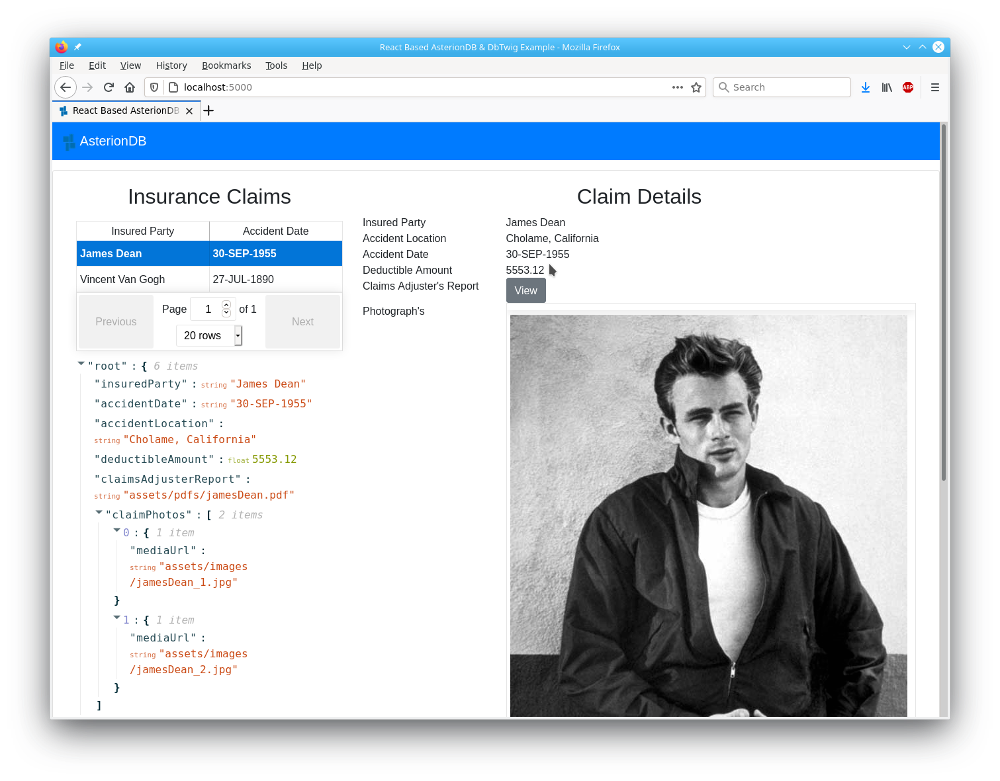

# React Based DbTwig / AsterionDB Example WebApp #

## Introduction ##

This React based example application will show you how to interface to DbTwig and AsterionDB.  It will also show you how to migrate an application from file-based to database oriented access.  The process really is quite simple and if you are already famliar with PL/SQL, you'll be able to follow along without any problems at all!

This example focuses on the tasks involved in migrating an existing application.  Having a working knowlege of Oracle, JavaScript and React is a requirement.  It is not suitable for those that are just starting out with the aforementioned technologies.

Specifically, in order to follow along with this example you will have to meet these pre-requisites:

  1.  Have a working installation of AsterionDB with an account that you can use to upload objects.
  2.  Know how to connect to your AsterionDB database with SQL*Developer (or a similar tool).
  3.  Working knowledge and familiarity with PL/SQL.
  4.  Familiarity with the JSON standard (note: it's so simple, you can probably look at it and figure it out...).
  5.  Working knowlege and familiarity with JavaScript, NodeJS and React.
  6.  Familiarity with DbTwig. We recommend that you consult the Readme.md for DbTwig.

## Objective ##

The object of this example application is to give you a realistic introduction to DbTwig & AsterionDB.  In the process you will learn the following:

  1.  Create an AsterionDB Client Application API Access Key
  2.  Upload objects into AsterionDB
  3.  Access the Object-IDs for the objects you have uploaded to AsterionDB
  4.  Modify an existing application to store Object-IDs instead of file pointers
  5.  Use JSON to return a complex master-detail 'document'
  6.  Generate a weblink by modifying a package in the database to interact with AsterionDB and DbTwig
  7.  Decouple changes in the data-model from the client application

After installation, we will start out by accessing the React example application in it's unmodified state.  We will upload objects to AsterionDB, modify the example application and see, with just a few changes, how easy it is to migrate an application.

## Installation ##

The React example application is delivered using AsterionDB's Docker based delivery mechanism.  The installation process performs the following steps:

  1.  Install system pre-requisites
  2.  Download the React example application
  3.  Build the JavaScript React example application
  4.  Runs SQL*Plus to install the example application's schema objects
  
In order to install the React example application you will need to gather the following usernames and passwords:

  1.  DBA username and password
  2.  DbTwig schema username [dbtwig]
  3.  DbTwig example schema username [dbtwig_examples] 
  4.  Choose a password for the DbTwig example schema
  5.  AsterionDB schema username [asteriondb_objvault]
  
While connected to your compute node as the 'asterion' user, issue the following command to run the Docker installer for the React example application:

    docker container run --rm asteriondb/install reactExample | bash -s

## Accessing The React Example Application ##

The React example application is designed to run in a stand-alone manner using it's own dedicated HTTP port address and server.  This allows us to isolate the application and keep it from impacting any other production or development systems.

While connected to your compute node as the 'asterion' user, type in the following commands:

  * cd /home/asterion/asterion/oracle/dbTwig/examples/react/javaScript/reactExample
  * serve -s build

This will run the Node-JS serve program and make the React example application available on port 5000.  To access the React example application, point your browser to:

  * http://localhost:5000
    
or

  * http://your.ip.address:5000

or

  * http://your.server.name:5000

If something is already running on port 5000, you can change the default port number as shown below:

  * serve -l 5001 -s build

If you are accessing your compute node via an SSH tunnel, you'll need to add a mapping for port 5000.  Here's an example:

  * ssh asterion@your.ip.address -L 8080:localhost:8080 -L 5000:localhost:5000

If your AsterionDB installation is not listening on it's default port (i.e. 8080) you will have to modify the React example application's configuration and then rebuild it.  Here are the steps:

  1.  Open up /home/asterion/asterion/oracle/dbTwig/examples/react/javaScript/reactExample/public/assets/config.js in an editor
  2.  Set the value of dbTwigHost appropriately (e.g. http://localhost:8888)
  3.  Set your current directory to /home/asterion/asterion/oracle/dbTwig/examples/react/javaScript/reactExample
  4.  Rebuild the React application by typing 'npm run build'

## The React Example Application - Serving Insecure File Based Assets ##

The React example application is a simple insurance claims mock-up that mainly endeavours to show the integration of structured and unstructured information.  The initial screen should look similar to this:

As you can see, we have structured data (the details of the insurance claim) and unstructured data (PDF report, images) displayed together on the webpage.  You can also see the raw JSON returned by DbTwig.  The JSON data containes file pointers for the PDFs and images.

## Interacting with DbTwig ##

As described in the DbTwig Readme.md file, 

alter table insurance_claims add report_id varchar2(32);
alter table insurance_claim_photos add photo_id varchar2(32);